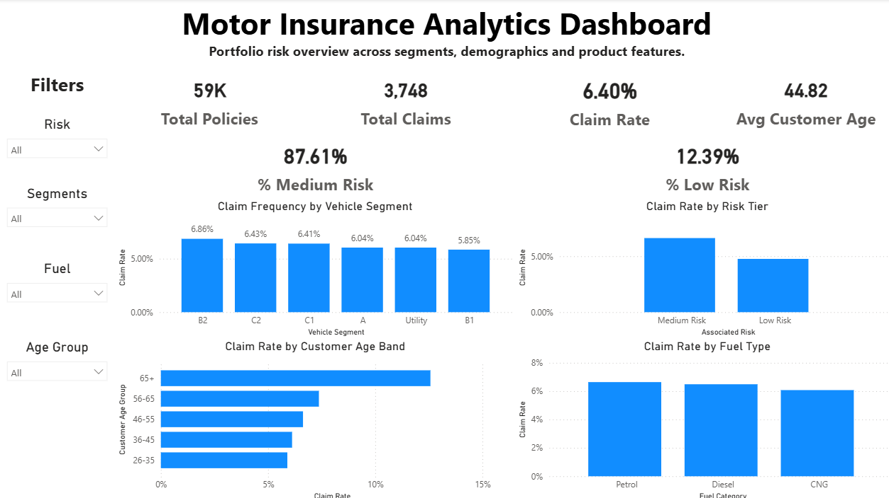

Motor Insurance Risk & Claim Probability Analytics

📌 Project Overview
Insurance businesses operate on risk. Even small improvements in identifying high-risk segments can significantly improve underwriting decisions and portfolio performance.
This project analyzes a motor insurance dataset to understand claim frequency patterns across customer demographics, vehicle characteristics, and product segments. The goal was to identify risk concentration areas and build an executive-level dashboard that supports data-driven underwriting insights.
This is a complete end-to-end analytics workflow — from raw data preparation to SQL analysis and interactive Power BI visualization.

🎯 Business Objective
The primary objectives of this project were:

Measure overall claim frequency within the portfolio
Identify high-risk vehicle segments
Analyze the impact of customer demographics on claim probability
Segment policies into risk tiers
Design a clean and interactive dashboard for portfolio monitoring

🗂️ Dataset Description
The dataset contains structured motor insurance policy records including:

Policy ID
Customer Age
Vehicle Age
Vehicle Segment
Fuel Type
Transmission Type
Region Code
Safety Features
Claim Status (0 = No Claim, 1 = Claim)

The data was cleaned, standardized, and engineered to support meaningful risk segmentation.

🧪 Feature Engineering
To enhance analytical depth, the following derived features were created:

Customer Age Band
Vehicle Age Band
Region-Level Claim Frequency
Risk Tier Classification (Medium / Low)

These engineered features allowed deeper segmentation beyond raw attributes.

🛠️ Tools & Technologies Used

Python (Pandas, NumPy) – Data cleaning, transformation, feature engineering
SQL (PostgreSQL) – Aggregation queries, segmentation analysis, KPI validation
Excel – Pivot-based summary analysis and validation
Power BI – Executive dashboard development
DAX – KPI calculations and dynamic measures

📊 KPI Framework
The following key metrics were defined to monitor portfolio risk:

Total Policies
Total Claims
Claim Frequency (%)
Average Customer Age
% Medium Risk Policies
% Low Risk Policies

Claim Frequency was calculated as:
Total Claims / Total Policies

This metric serves as the primary risk indicator across segments.

🧮 SQL Analysis Highlights
Using structured SQL queries, the following were evaluated:

Claim frequency by vehicle segment
Claim frequency by customer age band
Claim frequency by fuel type
Risk tier distribution
Portfolio-level claim aggregation

CTEs and grouped aggregations were used to compare segment-level performance against portfolio averages.

📈 Dashboard Overview
The Power BI dashboard is structured into two layers:
Executive Layer

Portfolio KPIs
Risk distribution metrics

Analytical Layer

Claim frequency by vehicle segment
Claim frequency by risk tier
Claim frequency by customer age band
Claim frequency by fuel type

Interactive slicers allow filtering by:

Risk Tier
Vehicle Segment
Fuel Type
Age Group

📷 Dashboard Preview
Example:

🔍 Key Insights

Overall claim frequency is approximately 6–7%
B2 and C2 segments show relatively higher claim frequency
Customers aged 65+ exhibit elevated risk levels
Medium-risk policies represent the majority of the portfolio
Fuel type impact is measurable but moderate

💡 Business Implications

Segment-specific pricing adjustments may improve underwriting accuracy
High-risk demographic groups may require tighter underwriting checks
Portfolio diversification strategies may reduce concentration risk
Continuous KPI monitoring is critical for proactive risk management

📁 Project Structure
Motor-Insurance-Risk-Analytics/
│
├── data/        # Raw and cleaned datasets
├── python/      # Data preparation and exploratory analysis notebooks
├── sql/         # Risk segmentation and aggregation queries
├── excel/       # Pivot-based validation analysis
├── dashboard/   # Power BI dashboard file (.pbix)
├── images/      # Dashboard screenshots
└── README.md
